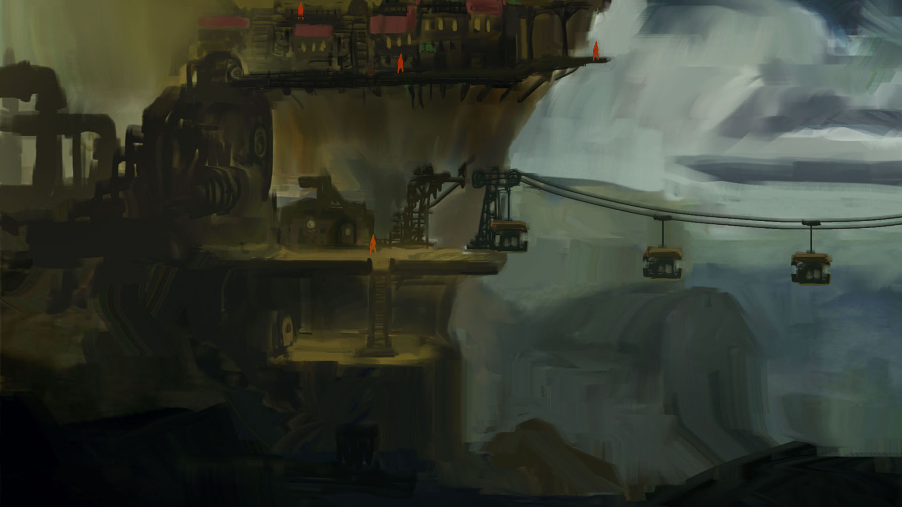

One game  
48 hours  
~440 lines of code  

I present to you my Ludum Dare #44 game, written in Python.  
Made using my engine, Ursina: https://pokepetter.github.io/ursina/  

Download the game here: https://ldjam.com/events/ludum-dare/44/value-of-life  

The build is for Windows, but to run it on Linux you can clone this repo and run
main.py with Python. as long as you have the necessary modules installed.
See Ursina repo for more info.
